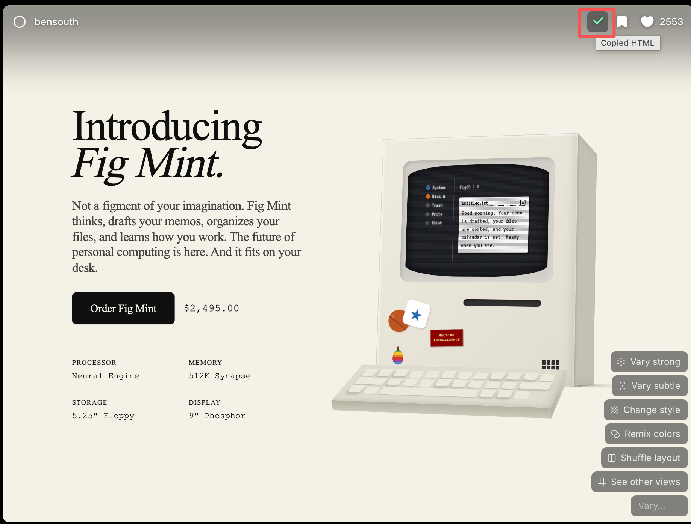

# Variant Copy

Variant Copy is a small Chrome/Edge extension for copying HTML source from cards on [variant.com/community](https://variant.com/community).

When you hover a community card, Variant shows bookmark and like actions. Variant Copy adds one more copy button to the left of the bookmark button. Clicking it reads the card's `data-design-id`, fetches `https://variant.com/design/<id>.html`, and copies the returned HTML source to your clipboard.

## Demo



## Features

- Adds a copy button directly inside Variant community cards.
- Copies the design HTML source with one click.
- Works with newly loaded cards during infinite scroll.
- Runs only on `https://variant.com/community*`.
- Includes a simple toolbar popup showing whether the current tab is ready.

## Install From GitHub Release

1. Open the latest release on GitHub.
2. Download `variant-copy-v0.1.0.zip`.
3. Unzip the file.
4. Open `chrome://extensions` or `edge://extensions`.
5. Enable Developer mode.
6. Click "Load unpacked".
7. Select the unzipped folder.
8. Reload [variant.com/community](https://variant.com/community).

## Install From Source

```bash
git clone https://github.com/Ryan-yang125/variant-copy.git
cd variant-copy
npm run icons
npm run check
```

Then load the repository folder from `chrome://extensions` with Developer mode enabled.

## Package A Release Zip

```bash
npm run package
```

The installable zip is written to:

```text
dist/variant-copy-v0.1.0.zip
```

## Permissions

Variant Copy keeps permissions narrow:

- `activeTab`: lets the popup read the active tab when you click the extension icon.
- `clipboardWrite`: lets the copy button write HTML source to your clipboard.
- `https://variant.com/design/*.html`: lets the content script fetch the design HTML source.

The content script is injected only on:

```text
https://variant.com/community*
```

Privacy details are documented in [PRIVACY.md](PRIVACY.md).

## How It Works

Variant community cards include a `data-design-id` attribute. For each card, Variant Copy builds this URL:

```text
https://variant.com/design/<data-design-id>.html
```

It fetches that HTML and writes the response text to the clipboard.

## Development

```bash
npm run check
```

This validates the JavaScript syntax and parses `manifest.json`.

```bash
npm run icons
```

This regenerates the extension PNG icons from the local Pillow drawing script.

## License

MIT
